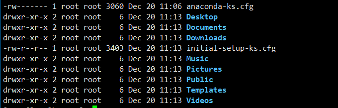

## 一、硬盘
1. MBR和GPT格式分区  
	主要分区预留1234和延伸。没有234延伸也是从5开始，sda1,sda5,sda6这种的。
2. BIOS和UEFI开机程序
	
## 二、基础功能
1. 常用信息
   *  ~ 代表用户主文件夹
   * locale 本地信息命令
   * date cal 时间日期；timedatectl
   * bc 计算器 quit退出
   * --help (-h 可能会模糊的被使用的，但是--help是精确的唯一的)
   * nano 命令文件编辑。使用vim代替，略过
2. `man [command]`, manual 帮助文档。command后括号中标记的数字代表一些含义，如NULL(4)4代表文件。
    * 1-shell环境中可以执行的命令或文件；
    * 5-配置文件或是某些文件的格式；
	* 8-系统管理员可以使用管理指令  
      - `man -f man` 查看属性
  	  - 多个参数把数字放在中间。
		``` 
		man 1 man
		```
	- `man -k man` 以man为关键字查询manual, like。 也可以使用 `whatis man`
	- 在/usr/share/doc/下有一些有用的文档。/usr/share/info下也有，info命令也可
3. 正确关机</br>
   1. `shutdown`
       * `man shutdown` 中有命令的介绍
       * `sync` 将内存中的数据写入到硬盘中，关机前做一个保存。</br>
       * 然后使用 **`shutdown`** 命令关机，默认是 `shutdown -h +1` 一分钟后关机。-h --halt多久后执行关机。
       * `shutdown -h 1:20` 1点20关机
	1. `reboot`
	   * reboot 和 poweroff 和 halt 一样，可以 `man reboot` 中看出
	   * 重启时鸟哥的操作 `sync; sync; sync; reboot`
	3. 和systemctl相关，作为systemctl后接指令

## 三、权限
有三个身份 `owner/group/others` , `read/write/execute` 等权限</br>

1. 文件的权限

   * `ls -al` 展示文件夹下文件信息。从左到右分别是 权限、链接、拥有者、群组、文件大小、修改日期、文件名
   
   * 权限项有十个字符，例如 `drwxr-xr-x`
      + 第一个字符表示"目录，文件或链接"
         - 为 \[d\] 时表示目录
         - **为 \[-\] 时表示文件**
         - 为 \[l\] 时表示链接
         - 为 \[b\] 时表示设备文件里可供存储的周边设备（可随机存取设备）
         - 为 \[c\] 时表示设备文件里的序列埠设备，如键盘鼠标（一次性读取设备）
      + 接下来的字符中以三个为一组，且均为"rwx"三个参数的组合。</br>
         - \[r\] 表示 "read" ; \[w\] 表示 "write" ; \[x\] 表示 "execute"。三个参数前后位置不会变化
         - 没有权限则用 \[-\] 代替
         - 第一组文件拥有者的权限，第二组加入此群组账号的权限，第三组非本人没有加入群组其他账号的权限
   * 链接数。表示有多少文件文件名链接到此节点
   * 文件名前如果有点 \[.\] 说明是隐藏文件
   * 如果是文件夹的话，没有执行权限是进不去文件夹的
2. 修改文件属性和权限


___

## 四、测试
* 这是谷歌[gooooooooooogle](https://www.google.com)
* 这不是我的邮箱<abc@hello.com>

	

	

	
	