## 一、硬盘
1. MBR和GPT格式分区  
	主要分区预留1234和延伸。没有234延伸也是从5开始，sda1,sda5,sda6这种的。
2. BIOS和UEFI开机程序
	
## 二、基础功能
1. 常用信息
   *  ~ 代表用户主文件夹
   * locale 本地信息命令
   * date cal 时间日期；timedatectl
   * bc 计算器 quit退出
   * --help (-h 可能会模糊的被使用的，但是--help是精确的唯一的)
   * nano 命令文件编辑。使用vim代替，略过
2. `man [command]`, manual 帮助文档。command后括号中标记的数字代表一些含义，如NULL(4)4代表文件。
    * 1-shell环境中可以执行的命令或文件；
    * 5-配置文件或是某些文件的格式；
	* 8-系统管理员可以使用管理指令  
      - `man -f man` 查看属性
  	  - 多个参数把数字放在中间。
		``` 
		man 1 man
		```
	- `man -k man` 以man为关键字查询manual, like。 也可以使用 `whatis man`
	- 在/usr/share/doc/下有一些有用的文档。/usr/share/info下也有，info命令也可
3. 正确关机</br>
   1. `shutdown`
       * `man shutdown` 中有命令的介绍
       * `sync` 将内存中的数据写入到硬盘中，关机前做一个保存。</br>
       * 然后使用 **`shutdown`** 命令关机，默认是 `shutdown -h +1` 一分钟后关机。-h --halt多久后执行关机。
       * `shutdown -h 1:20` 1点20关机
	1. `reboot`
	   * reboot 和 poweroff 和 halt 一样，可以 `man reboot` 中看出
	   * 重启时鸟哥的操作 `sync; sync; sync; reboot`
	3. 和systemctl相关，作为systemctl后接指令

## 三、文件与目录
文件有三个身份 `owner/group/others` , 有`read/write/execute` 等权限</br>

1. 文件的权限

   * `ls -al` 展示文件夹下文件信息。从左到右分别是 权限、链接、拥有者、群组、文件大小、修改日期、文件名
   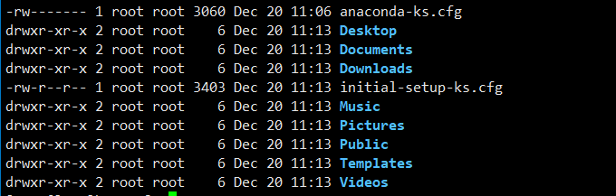
   * 权限项有十个字符，例如 `drwxr-xr-x`
      + 第一个字符表示"目录，文件或链接"
         - 为 \[d\] 时表示目录
         - **为 \[-\] 时表示文件**
         - 为 \[l\] 时表示链接
         - 为 \[b\] 时表示设备文件里可供存储的周边设备（可随机存取设备）
         - 为 \[c\] 时表示设备文件里的序列埠设备，如键盘鼠标（一次性读取设备）
      + 接下来的字符中以三个为一组，且均为"rwx"三个参数的组合。</br>
         - \[r\] 表示 "read" ; \[w\] 表示 "write" ; \[x\] 表示 "execute"。三个参数前后位置不会变化
         - 没有权限则用 \[-\] 代替
         - 第一组文件拥有者的权限，第二组加入此群组账号的权限，第三组非本人没有加入群组其他账号的权限
   * 链接数。表示有多少文件文件名链接到此节点
   * 文件名前如果有点 \[.\] 说明是隐藏文件
   * 如果是文件夹的话，没有执行权限是进不去文件夹的
2. 修改文件属性和权限</br>
   chgrp, chown, chmod。修改文件组用户权限的命令。-R 选项可以递归修改文件夹。</br>
   chown 还可以一同修改组。chown \[-R\] 帐号名称:群组名称 文件或目录
   * chmod
      + 数字模型对应权限</br>
         **read:4, write:2, x:1** 配合owner/group/others的顺序就可以计算了</br>
         例如owner全部，group读和执行，other没有权限那么相加计算完就是 730</br>
         `chmod -R 730` 递归计算权限
      + 字母模型</br>
         **`chmod u=rwx,go=rx file`** user赋予rwx权限，group和others拥有rx权限</br>
         `chmod a+r` 所有人添加r权限</br>
         `chmod a-w` 所有人去掉w权限</br>
3. 目录权限的意义
   * 对文件来说。r是阅读。w是修改的权限（不含删除）。x是执行的权限，区别于windows依靠扩展名进行判断。**是否可删除需要看有没有上级目录的w的权限**
   * 文件夹来说。r是读文件夹下文件名的权限。w是对文件夹下**增、删、改、被移动，更名**的权限。x是进入文件夹的权限，否则不能cd进去
4. 文件名和扩展名
   * **linux下一切皆文件**
   * 各种类型
      + 文件
         - ASCII文件。可以被cat
         - 二进制文件。cat命令就是二进制文件
         - data。固定格式的文件
      + 目录。权限开头为\[d\]
      + 链接。权限开头为\[l\]
      + 设备与设备文件(device)。系统周边和存储相关的文件，一般在/dev下。
         - 区块(block)设备文件。如硬盘等。权限开头为\[b\]
         - 字符(character)设备文件。如键盘鼠标等。权限开头为\[c\]
      + 数据接口(sockets)文件。网络上的数据沟通。一般在/run或/tmp下。权限开头为\[s\]
      + 数据传输(FIFO, pipe)。队列读文件(first in first out)。权限开头为\[p\]</br>
      可以通过 `man fifo` , `man socket` 查看信息
   * 文件扩展名</br>
      文件可不可以执行一个是x，另一个是本身是否可以被执行。如文本即使有x也不能被执行，cat命令去掉x后也不能被执行</br>
      一般扩展名有：</br>
      * .sh。脚本或批处理文件。用shell写成。
      * Z, .tar, .tar.gz, .zip, .tgz。各种压缩文件
   * 文件名长度限制。依照文件系统设置，在.ext2/.ext3/.ext4文件系统下是255Bytes
   * 文件命名限制。最好不要包含特别特殊的符号如 ``? > <br ; & ! [ ] | \ ' " ` （ ） { }`` 同时避免使用 `+ -` 开头，`.` 开头的是隐藏文件
5. 文件和目录拥有的默认权限和隐藏权限</br>
   * 默认权限
      * 输入 `umask -S` 查看当前使用使用者创建文件时的默认权限。
      * 输入 `umask` 出现4个数字，后3个数字和权限相关。例如0022是指三个角色的权限要减去的权限。</br>
      **创建文件时默认权限（-rw-rw-rw-）**，减去-----w--w-, 剩下-rw-r--r--</br>
      **创建目录时默认权限（drwxrwxrwx）**, 减去-----w--w-, 剩下-rwxr-xr-x</br>
        因为文件本身没有执行权限，所以创建时默认没有x。计算时不要用数字直接刨去，要用去掉的权限来看。
      * 修改创建时的权限。`umask 002` 之后创建文件时同组也拥有和owner一样的权限，
   * 隐藏权限</br>
   使用 `chattr` 给文件设置隐藏权限，只能在Ext2/Ext3/Ext4的Linux文件系统上完整支持。</br>
   使用`charttr [+-=] [aAcCdDeFijPsStTu] file`给文件加上减去或者设置权限。详细属性设置使用 `man chattr` 
   * 特殊文件权限</br>
      + set UID</br>
       出现在文件拥有者的x位置上，如/usr/bin/passwd。修改密码是修改/etc/shadow，该文件只能root修改，其他用户可以改自己的密码。过程是这个样，其他用户有执行/usr/bin/passwd的权限，在用户执行修改密码命令时短暂获得root权限，修改完文件然后结束。要素是以下几项。
         - 执行者拥有x权限
         - SUID仅对二进制程序有效
         - 本权限仅限执行过程有效，且在期间获得root权限
      + set GID</BNR>
       当s出现在群组的x位置上时成为set GID。如/usr/bin/locate拥有的权限，去执行/var/lib/mlocate/mlocate.db。该命令和文件都是同一群组，命令的group权限的x位置上是s</br>
       要素类似
         - SGID对二进制程序有效
         - 程序执行者需要有程序的x权限
         - 执行过程中获得程序的群组--slocate--的权限
         
         该权限也可以使用在文件夹上。文件夹group的x变为s，文件夹下群组用户创建的文件的群组为该群组。没有该权限的话，创建的文件的群组将是自己
      + Sticky Bit</br>
       只针对文件夹有效，对文件无效。在other的x上是一t。作用如下
         - 使用者对文件夹拥有wx权限，即写入权限
         - 使用者在该文件夹下创建文件夹和文件后，只有创建者和root能删除
       
        例如在/tmp就有该权限，所有人全权限。使用root创建一个文件，使用其他账号登入不能删除该文件
      + SUID/GUID/SBIT权限设置</br>
       SUID代表4，GUID代表2，SBIT代表1。使用数字设置权限时，把这个数字放在权限数字位置前面，有多个时累加。如将文件权限设置为'-rwsr-xr-x'时，这样更改权限 `chmod 4755 filename`。在设置7666时，会出现大写ST的情况如下
       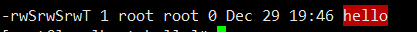</br>
       赋权时也可以使用字母SUID是u+s，SGID为g+s，SBIT是o+t。如：
         ```
         chmod u=rwxs,go=x test
         chmod g+s,o+t test
         ```
   * 查看文件类型使用 `file filename` 命令</br>
      如 `file /usr/bin/passwd`查询结果
      ```
      /usr/bin/passwd: setuid ELF 64-bit LSB pie executable, ARM aarch64, version 1 (SYSV), dynamically linked, interpreter /lib/ld-linux-aarch64.so.1, BuildID[sha1]=49f22547cc152082477e4f2b00eb08056cdb29d9, for GNU/Linux 3.7.0, stripped
      ```
      
6. 文件内容浏览</br>
      浏览文件，几个常用命令</br>
      `cat` 从第一行开始显示</br>
      `tac` 从最后一行开始显示，和cat反着</br>
      `nl` 显示出来，顺便显示行号</br>
      `more` 一行一行显示</br>
      `less` **和more类似，但可以向上翻页** 比较重要的命令，man文档就是用的less命令</br>
      `head` 只看头几行</br>
      `tail` 只看尾巴几行</br>
      `od` 以二进制方式读取文件内容</br>

   * ` cat [-AbEnTv]` -n 可以打出行号
   * `tail -f filename` 连续输出
7. 修改文件时间或创建文件 `touch` </br>
   linux中每个文件会记录多个时间。其中有几个重要的时间查看</br>
      * modification time(mtime)。文件内容修改时记录。`ls -l filename`查看的时间就是该时间
      * status time(ctime)。状态修改时更新该事件。如权限和属性。`ls -l --time=ctime filename`
      * access time(atime)。文件被读取就会更新该事件。如被cat过。`ls -l --time=atime`

   如果文件时间错乱了，比如系统时间错误导致创建的时间在未来等问题时。可以使用touch命令修正, ``touch [-acdmt] filename``。
      * -a: 修改access time
      * -c: 修改mtime和atime, 没有文件则创建文件
      * -d: 后面可以接续自定的时间，而不是当前的时间，--date=
      * -m: 仅修改mtime
      * -t  ：后面可以接欲修订的时间而不用目前的时间，格式为\[YYYYMMDDhhmm\]
8. 指令和文件的搜寻
   * `which` 搜寻命令。搜寻可执行文件, 参数-a查出所有而非第一个找到的。该命令根据PATH环境变量规范的路径查询可执行文件</br>
    `which ls` 查看ls命令的位置</br>
    `which which` 查看which命令的位置，结果有两条一个是别名</br>
    `which history` 查看history命令没有结果，因为history是bash内置命令，不在PATH内。</br>
    或者使用 `type` 命令
   * 文件的搜寻。**一般不用find命令**速度慢费硬盘。
      + `whereis [-bmsu]` 命令在特定的目录下搜寻
         - `-l` 列出whereis回去查询的主要目录
         - `-b` 只找寻二进制文件
         - `-m` 只找寻在manual路径下的文件
         - `-s` 只找寻source来源的文件
         - `-u` 只找寻不在上述三个项目中的特殊文件

         例如：`whereis ifconfig` 找寻ifconfig的位置。`whereis -m passwd`在手册中寻找passwd</br>
         快的原因是没有全盘搜索，只在特定的目录下进行搜寻， 使用`whereis -l` 便可知搜寻范围
      + `locate/updatedb`
         - locate \[-ir\] keyword
           - `-i` 忽略大小写的差异
           - `-c` 不输出文件名，只计算找到文件的数量
           - `-l` 控制结果输出几行
           - `-S` 输出locate所使用的数据库文件相关信息，包括数据库记录的文件目录数量等
           - `-r` 后面可以接正则表达式
       
           例如：`locate -l 6 passwd` 输出和passwd相关的5个文件名。第一次查询提示没有数据库，使用`updatedb`更新后再查询。</br>
           `locate -S` 查询数据库文件记录信息。</br>
           使用限制是文件名存储在/var/lib/mlocate数据库中的，没有记录的话及搜寻不到，数据库一般每天自动更新一次硬盘上的文件名。如果是新的文件名没有记录进去的话，使用`updatedb`命令进行更新，更新搜寻文件夹记录范围等使用的配置在/etc/updatedb.conf中记录。
      + `find [path] [option] [action]` 
        - 与时间有关的选项。有-atime, -ctime, -mtime。以-mtime说明：
          - -mtime n: n天前的一天之内被更改过的文件
          - -mtime +n: n天之前被更改过的文件
          - -mtime -n: n天之内被更改过的文件
          - -newer file: file作为一个存在的文件，列出比file更新的文件
        
          例如：`find / -mtime 0` 含义是24小时之内所有更新过的文件</br>
          `find /etc -newer /etc/passwd` 含义是在/etc寻找比/etc/passwd更新的文件</br>
          +n, -n, n 构成n天前，n天内，和n天那一天
        - 与用户和群组相关的参数
          - -uid n: n是使用者的uid
          - -gid n: n是群组名称的id
          - -user name: name是使用者的名称
          - -group name: name是群组的名称
          - -nouser: 寻找文件的用户不在/etc/passwd中的用户的文件
          - -nogroup: 寻找群组不在/etc/group的群组的文件
          
          例如：`find /home -user dmtsai` 在/home下寻找用户是dmtsai的文件</br>
          `find / -nousr` 在根目录下寻找没有没有在/etc/passwd中记录的用户的文件，一般使用源码编译时会有这种情况发生
        - 与文件权限和名称相关的参数
          - -name filename: 搜寻名称是filename的文件
          - -size [+-]SIZE: 搜寻比SIZE大还是小的文件，SIZE规格c代表Byte，k代表1024Bytes。如搜寻比50k大的文件“-size +50k”
          - -type TYPE    ：搜寻文件的类型为 TYPE 的，类型主要有：一般正规文件 （f）, 设备文件 （b, c）,
                   目录 （d）, 链接文件 （l）, socket （s）, 及 FIFO （p） 等属性。
          - -perm mode  ：搜寻文件权限“刚好等于” mode 的文件，这个 mode 为类似 chmod
                 的属性值，举例来说， -rwsr-xr-x 的属性为 4755 ！
          -  -perm -mode ：搜寻文件权限“必须要全部囊括 mode 的权限”的文件，举例来说，
                 我们要搜寻 -rwxr--r-- ，亦即 0744 的文件，使用 -perm -0744，
                 当一个文件的权限为 -rwsr-xr-x ，亦即 4755 时，也会被列出来，
                 因为 -rwsr-xr-x 的属性已经囊括了 -rwxr--r-- 的属性了。
          - -perm /mode ：搜寻文件权限“包含任一 mode 的权限”的文件，举例来说，我们搜寻
                 -rwxr-xr-x ，亦即 -perm /755 时，但一个文件属性为 -rw-------
                 也会被列出来，因为他有 -rw.... 的属性存在！

            例如：`find / -name passwd` 在根目录下寻找passwd的文件</br>
            `find / -size +1M` 找出系统中规格大于1M的文件</br>
            `find / -name "*passwd*"` 用关键字方式在根目录下像passwd的文件</br>
            `find /run -type s` 查找/run下类型是socket类型的文件</br>
            `find / -perm /7000` 7000 就是 ---s--s--t

            使用-perm就能找到一些特殊权限的文件，还可以把待搜索文件夹并列写出来。例如在/usr/bin, /usr/sbin下寻找有SUID, SGID权限的文件：</br>
            `find /usr/bin /usr/sbin -perm /6000`
         - 额外的可进行的操作
           - -exec command: command为其他指令， -exec后可接续额外的指令处理搜寻到结果
           - -print: 将结果打印出来，这个动作是默认动作
           
           例如：`find /usr/bin /usr/sbin -perm /7000 -exec ls -l {} \;` 该命令将上个例子中的文件信息具体打印出来，有几个特殊的地方“{}”, “\\;”，“-exec”.
             -  {} 代表的是find找到的内容，在命令中前一半由find找到的内容放到{}中
             -  从-exec 到 \;。代表额外动作从 `-exec` 开始到 `\;` 结束，即`ls -l {}` 注意 `ll` 命令是别名不能放到其中，其他很多场合也是这样
             -  `\;` 因为 `;` 在bash环境下有特殊意义，因此使用反斜杠来跳脱

   一般使用whereis和locate就够了，在这两个命令不能满足时再使用find命令。find命令比较费硬盘

   建立新group, `groupadd project`</br>
   建立新用户, `useradd -G project alex`</br>
   `useradd -G project arod`</br>
   创建文件夹`mkdir /srv/ahome`</br>
   更改群组`chgrp project /srv/ahome`</br>
   更改权限`chomd 770 /srv/ahome`</br>
   `passwd alex XshCh&xHyi7pybCL`</br>
   `passwd arod f%n1s483Ke&w#oEm`</br>
   `su - alex` 切换的alex账户</br>
   `cd /srv/ahome`</br>
   `touch 1234` 创建文件</br>
   `su - arod` 切换用户</br>
   `cd /srv/ahome` </br>
   `ls -l` 创建的1234文件不能编辑，文件的群组是alex，不是我们想要的效果</br>
   `su` 切换到root，重新分配权限</br>
   `chmod 2770 /srv/ahome` 将文件夹建立成共享状态，建立的文件的群组是创建者的群组

## 四、磁盘与文件系统管理
最传统的磁盘文件系统使用EXT2。复习磁盘分区。重点是inode, block和superblock
1. 磁盘组成分区复习
   * 磁盘由圆形盘片，机械臂，主轴马达。马达转动盘片，使得机械臂读取盘片上的数据
   * 盘片组成
     * 扇区。有512Bytes和4K两种规格
     * 柱面。由扇区组成的圆环就是一个柱面
     * 早期分区以柱面为最小单位，现在以扇区为最小单位
     * 磁盘分区表两种格式，早期的MBR, 和GPT分区表
     * MBR分区表中，第一个扇面最重要。分为主要开机区(Master boot record MBR)和分区表(partition table)，其中MBR占有446Bytes，partition占有64Bytes
     * GPT分区数量扩充，支持容量超过2TB
     * 磁盘命名方式：
       + /dev/sd[a-p][1-128]：为实体磁盘的磁盘文件名
       + /dev/vd[a-d][1-128]：为虚拟磁盘的磁盘文件名
2. 文件系统特性

   介绍文件系统和分区关系。传统上一个分区就是一个文件系统，采用同一种文件访问方式。现在使用LVM与软件磁盘阵列(software raid)技术可以将一个分区分为多个文件系统，也可以将多个分区合为一个文件系统。整体和文件信息分布在superblock, inode, datablock中
   * superblock: 记录此filesystem的整体信息，包括inode/datablock的总量使用量剩余量，以及文件系统的格式和相关信息。
   * inode: 记录文件属性。一个文件占用一个inode, 同时记录文件的数据所在block的号码
   * block: 记录实际文件的内容。若文件太大时，会占用多个block
   
   每个inode和block都有编号。每个文件占用一个inode, inode中记录文件数据库放置的block号码。例如一个inode中记录多个block号码，读取时一次读出。这种文件系统成为索引式文件系统(indexed allocation)。U盘一般采用FAT格式文件系统，没有inode。多个区块存文件时，上一个区块存下一个区块的位置，类似于链表方式。如下图所示：</br>
   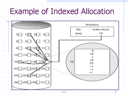
   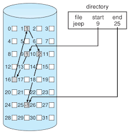
3. linux的EXT2文件系统(second extended filesystem)

   当磁盘很大时，把block和inode分开存放不太明智。所以格式化时分为区块群组，每个区块群组都有独立的 inode/block/superblock 系统。文件系统由一个开机扇区开头再带上一堆区块群组，一个磁盘分为多个文件系统时就可以设置多重开机环境，一个文件系统一个开机扇区。每个区块组的六部分组成。以下内容没有明确指出的情况下都是EXT2环境中的信息

      * data block
         
         data block是存放文件数据的地方。在EXT2文件系统中支持的block大小有1k, 2k, 4k三种。在格式化时block大小固定，每个block都有编号来存在inode中。block大小不同会决定文件系统最大值和单一文件最大值的不同。在EXT2下的对应值：

         | block大小 | 1KB | 2KB | 4KB |
         | :----: | :----: | :----: | :----: |
         | 最大单一文件限制 | 16GB | 256GB | 2TB|
         | 文件系统最大容量 | 2TB | 8TB | 16TB|

         EXT2中的data block还有如下限制：

           * block在格式化后不能改更大小
           * 每个block最多能放一个文件的数据
           * 如果文件大于block的大小，文件会占用多个block
           * 若文件没有占满block的大小，block剩下的地方也不能被使用了
           
         如果block是4K，存储的文件都是2K，每存入一个文件就浪费一半空间。理论上情况是这样的。
      * inode table
 
         inode存储文件的属性以及位置等信息，至少包含如下：
         
         * 文件的存取模式(r/w/x)  
         * 文件的拥有者和群组(owner/group)
         * 文件的容量
         * 文件创建或状态更改的时间(ctime)
         * 文件最近一次读取的时间(atime)
         * 文件最近一次修改的时间(mtime)
         * 文件特性标识，如setUID等
         * 文件内容真正的指向
         
         inode的数量和大小在格式化时也会固定下来，此外inode还有以下特点

         * 每个inode大小是128Bytes（新的ext4和xfs可以设置到256Bytes）
         * 每个文件仅仅占用一个inode
         * 文件系统能够创建的文件数量和inode数量有关
         * 系统读取文件时先找到inode, inode记录的权限和使用者相符才可以读取block中的值
         
         inode和data block的关系。inode有128Bytes, 记录一个block需要4Bytes（4Bytes有42亿多的不同组合）。如果一个文件400MB每个block4K，如果直接记录所有区块信息需要记录1万个block地址。inode记录block定义为12个直接、一个间接、一个双间接，一个三间接。使用1K的block进行说明。如图inode内连接block方式:

         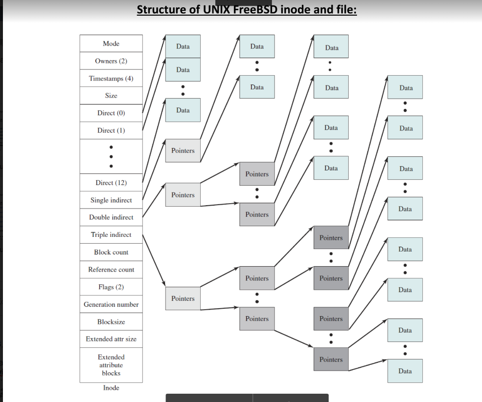

         * 12个直接指向。每个记录一个block地址，所以最多记录12K内容
         * 一个间接指向。伸出**一个分支指针**。指向一个block，该block内全部存block的地址，1K大小4Bytes一个地址，故能指向256个数据block。间接指向最多256K。
         * 一个双间接指向。伸出**2层分支指针**。先像间接指向一样指向一个block，该block内存下一层指针的地址。第二层256个block全部存指针。最终最多指向256\*256个数据block。
         * 一个三间接指向。伸出**3层分支指针**。和双间接类似，在第三层指向数据block全部换成指针，即256\*256个指针block。最终在第四层指向256\*256\*256个数据block。
         * 所以在1K大小block的情况下，第一层12K数据（和3*256个指针），第二层256K数据（2\*256\*256个指针），第三层256\*256K数据（256\*256\*256个指针），第四层256\*256\*256K数据。加起来
            
               12 + 256 + 256*256 + 256*256*256(K) = 16,843,020 K ≈ 16 G

         查看上面的表格是符合的。但是不能用于2K和4K大小的block的计算，大于等于2K的block会受EXT2文件系统的限制。在EXT4中inode是256Bytes，可以记录新的额外信息。单个文件上限达到16TB，文件系统上限达到1EB。
      * superblock（超级区块） 
         
         superblock是记录整个filesystem相关信息的区域。没有superblock就没有filesystem了。superblock记录的信息主要有：
         
         * block和inode的总量
         * 未使用和已使用inode/block的数量
         * block和inode的大小（block为1/2/4K，inode为128/256Bytes）
         * filesystem的挂载时间、最近一次写入数据的时间、最近一次检验磁盘(fsck)的时间等文件系统相关的信息
         * 一个valid bit的数值，若文件系统已被挂载为0，未被挂载为1
         
         superblock非常重要。它死了文件系统也就坏了。一般是1024Bytes大小。之后可以使用 `dumpe2fs` 命令查看。一般来说应该只有一个superblock才对。第一个groupblock一定会有superblock，之后的groupblock有的话则是第一个superblock的备份。
      * Filesystem Description（文件系统描述说明）
         
         这个区段可以描述每个 block group 的开始与结束的 block 号码，以及说明每个区段 （superblock, bitmap, inodemap, data block） 分别介于哪一个 block 号码之间。这部份也能够用 dumpe2fs 来观察的。
      * block bitmap
      
         记录哪些是空的block哪些是被使用的block。记录文件插入和删除时block标志的变换。
      * inode bitmap
      
         和block bitmap类似，记录的是inode的使用情况
      * dumpe2fs: 查询Ext家族superblock信息的命令

         如果使用的是xfs文件系统，怎不能使用dumpe2fs命令。之后格式化出一个文件系统用于测试。</br>
         使用 `df -hT` 和 `blkid` 结合的看文件系统信息。</br>
         执行命令 `dumpe2fs /dev/vda1` 查看所有区块信息，
        
         * -h ：仅列出 superblock 的数据，不会列出其他的区段内容
         * -b ：列出保留为坏轨的部分
         
         展示的结果有些多，上述提到到信息都可以看到。可以看下group block 0 的信息：

         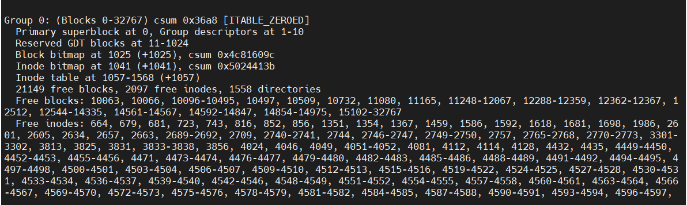
         
         * 占用block号码从0到32767，superblock在0号block中，descriptors在1到10号block。
         * Block bitmap在1025上，Inode bitmap在1041上。
         * Inode table在1057到1568之间的区块上
         * 共有1568 - 1057 + 1 = 512 个区块用于记录Inode。由命令的结果信息可知一个区块4K，一个Inode512Bytes，所以一共 512 * 4096 / 256 = 8192 个Inode。这个信息在结果中也能看到
         * 可用block 21149，可用inode2097个，以及这些可用block的号码
4. 文件系统与目录树的关系
   * 目录
   
      创建目录时系统会分配一个inode和至少一个block给该目录。inode记录目录的权限和属性，和分配到的block的号码。分配的block记录目录下的文件名和文件占用的inode的信息。展示出目录的大小指的是目录指向block的大小，一般都是4096的倍数，因为一个block就是4KBytes。
   * 目录树读取
     
     目录内的文件名和地址是在目录inode的block中存储。目录树从根目录读起，系统通过挂载信息找到挂载点的inode号码，然后找到根目录block中文件名一层一层读取。例如要读取/etc/passwd的过程：
     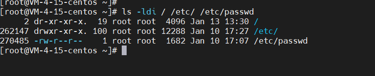
     * /的node：通过挂载点的信息找到inode号码为2的根目录的inode，且inode记录的权限（rx）可以读取/记录block的内容
     * /的block：通过/的block，得知里面存入/etc目录的inode号码262147。
     * /etc的inode: 读取262147号inode得知有读的权限，读取/etc的block
     * /etc的block: 读取/etc/passwd的inode的号码270485
     * passwd的inode: 读取270485得知用户有r权限，可以读取block中的内容
     * passwd的block: 将该block的内容读取出来
     
     filesystem大小和磁盘读取性能有关。如果频繁读写，文件一般不能写在连续的block中。如果文件过于离线时，磁头需要频繁移动去读取文件。可以将整个文件系统拷贝出来，再复制回去时文件就是连续的状态了。如果文件系统过于大，假设一个文件的block分布在最前面和最后面的话，读取时磁盘机械臂移动幅度大，也会导致读取效率低下。所以不是分区不是分的越大越好。
5. EXT2/EXT3/EXT4文件存取与日志式文件系统的功能
   
   如果要新增文件时系统是怎么处理的呢
     1. 先确定使用者对目录是否有wx的权限
     2. 根据inode bitmap找到没有使用的inode号码，并根据新文件的权限属性写入
     3. 根据block bitmap找到没有使用的block号码，并将实际的文件写入block，更新inode block指向数据
     4. 将刚写入的inode和block数据同步更新inode bitmap和block bitmap，更新superblock内容
      
   一般将inode table和data block成为数据区域。其他superblock/block bitmap/inode bitmap称为metadata(中介数据)。每次变更和读取都可能会导致中介数据的变更。

   * 数据不一致的状态

   如果在写入inode和block后系统发生故障，没有更新metadata。这时就发生了中介数据和实际数据不一致的情况。
   
   不一致时系统会在重新开机时，由superblock中的valid bit（是否挂载）和filesystem state（clean与否）等状态来判断是否强制进行数据一致性的检查。若需要检查时使用`e2fsck`命令进行检查。

    但是检查是十分费时。检查时针对metadata和实际数据存放区进行对比。如果文件系统十分大而且对提供网络服务的服务器来说修复时间十分长。

   * 日志式文件系统(journaling filesystem)

   为了避免上述数据不一致的情况发生，有人想出一种办法。在文件系统中划出一块区域专门记录文件变更的步骤。这样可以简化一致性检查的步骤。过程：
      1. 预备：当要写入一个文件时，现在日志记录区中记录某个文件准备写入的信息。
      2. 实际写入：开始写入文件的权限和数据，开始更新metadata的数据
      3. 结束：在完成数据和metadata的更新后，在日志记录区完成该文件的记录
      
   万一数据变更过程中发生问题，系统只要检查日志记录区即可，就能知道那个文件发生了问题，而不必针对真个系统进行一致性检查。达到快速修复文件系统的目的，这就是日志式文件系统的基础的功能。

   /EXT4就具备这个这样的功能。在 `dumpe2fs -h /dev/vda1 `命令的结果中，superblock的信息中有包含有日志区别的信息。
6. Linux文件系统的运行

   文件要读到CPU中才可以处理。如果有一个十分大的文件要编辑，又要频繁地要系统写入磁盘。磁盘写入比内存慢很多，这样的话就把时间耗在等待磁盘IO上了，没有效率。

   为了解决这个问题，Linux使用非同步处理(asynchronously)的方式。原理是这样的。文件载入到内容中，没有变更过的话，被设置为一个clean的标识。如果发生变更，clean标识变为dirty。此时都发生在内存中没有写入到磁盘中。系统会不定时地把标记为dirty的数据写入到磁盘中，来保持数据一致性。也可以使用之前提到的`sync`命令手动强制写入磁盘。把经常使用的文件放到内存中会提升性能。所以Linux的文件系统和内存间的调度关系紧密：
      * 系统会将常用的文件放到缓存区，加快读写。   
      * Linux内存会被使用耗尽，这是正常的保证系统性能
      * 正常关机时，系统会调用`sync`把内存标识为dirty的数据写入磁盘。也可以手动调用写入
      * 如果不是正常关机（如突然断电、死机或其他原因），由于数据没有正常写入磁盘，开机后可能会花很多时间进行磁盘检查，甚至可能导致文件系统的损毁（非磁盘的损毁）
7. 挂载点的意义
   
   每个文件系统都有独立的inode/block/superblock等信息。将文件系统链接到目录树上才能被使用。将文件系统和目录树挂钩的过程称为**挂载**。挂载点必须是目录，该目录变为该文件系统的入口。文件系统只有挂载后才能被使用。

   使用`ls -ild [dir] [dir1]`观察目录的inode信息
8. 其他Linux支持的文件系统和VFS

   Linux标准文件系统是EXT2，和增加了日志功能的EXT3/EXT4。Linux支持常见的文件系统
      * 传统文件系统：EXT2/minix/MS-DOS/FAT(用vfat模块)/iso9660(光盘)等等
      * 日志式文件系统：ext3/ext4/ReiserFS/Windows'NTFS/IBM's JFS/SGI's XFS/ZFS
      * 网络文件系统：NFS/SMBFS
   
   使用命令查看自己的Linux支持什么文件系统：`ls -l /lib/modules/$(uname -r)/kernel/fs`
   

   查看目前载入到系统的文件系统：`cat /proc/filesystems`

   * Linux VFS(Virtual Filesystem Switch)

   Linux如何管理这些认识的文件系统。VFS的核心功能就是读取文件系统。Linux所认识的文件系统都由VFS管理。使用者不必关系每个分区上是什么文件系统，VFS会主动帮我做好读取工作。

   假设/使用的是设备/dev/hda1，类型是ext3；/home使用的设备是/dev/hda2，类型是reiserfs。取用/home/dmtsai/.bashrc不需要指定文件系统，背后由VFS帮助管理。VFS在文件系统上层做管理。
   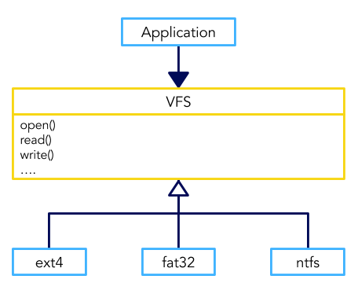
9. XFS文件系统简介

   CentOS 7 开始默认文件系统由EXT4变成XFS文件系统，EXT存在着一些劣势。

   * XFS文件系统的配置 
   
   xfs是一个日志式文件系统。最初xfs被开发用于大容量磁盘和高性能文件系统使用。拥有几乎所有EXT4的功能。xfs在数据分布上主要规划为3个部分。数据区(data section)，文件系统活动登录区(log section)，实时运行区(realtime section)。

   * 数据区

   数据区和ext家族的一样，包括 inode/data block/superblock 等数据，都放置在这个区块。和group block类似，分为多个存储群组(allocation groups)。每个群组包含（1）整个文件系统的superblock，（2）剩余空间管理机制，（3）inode的分配和追踪。inode和block都是系统需要时才动态配置产生，所以格式化动作快。

   与ext家族不同的是，xfs的block和inode有不同的容量可供设置。block由512Bytes到64K调配，不过由于Linux的内容控制的原因，block最高还是4K。inode256Bytes到2M，256Bytes是够用的。

   * 文件系统活动登录区
   
   主要用来记录文件系统的变化，类似日志区。文件变化在此处记录，直到文件完整写入数据库，该笔记录才算完成。文件系统发生损毁时，系统会到这里进行校验，来确认损毁前发生了什么，用以快速恢复文件系统。

   系统所有动作都会记录到该区域，所以该区域磁盘活动十分频繁。xfs设计可以指定外部磁盘来记录xfs日志活动。所以可以找一块SSD作为日志记录区，可以更快。

   * 实时运行区
  
   当文件要被创建时，xfs会在这个区域找一块或多个extent区块，将文件放到区块内。到分配完毕后，在将文件写入到data section。extent区块的大小要在格式化时就指定大小，范围从4K到1G。一般非磁盘阵列默认64K，具有类似磁盘阵列的stripe的情况下，建议将extent设置和stripe一样大。extent大小不要乱动，会影响到磁盘的性能。

   * xfs的描述数据观察
   
   xfs也有类似ext家族的`dumpe2fs`的命令，xfs_info命令。</br>
   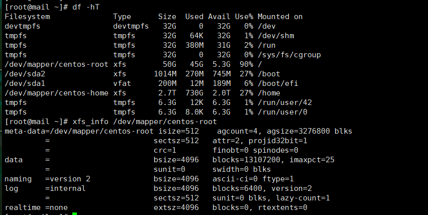</br>
   使用 `df -hT` 找到磁盘挂载情况。</br>
   再使用 `xfs_info /dev/mapper/centos-root` 命令。参数是挂载设备。输出结果包含信息：
      * meta-data第1行的isize就是inode的大小512Bytes。agacount是存储群组(allocation group)的数量4个。agsize每个存储群组中包含3276800（3200 * 1024）个block。结合第四行每个block4K，一个存储群组就是12.5G。4个存储群组就是50G，和第一个命令中的结果一样
      * meta-data第2行中sectsz是逻辑扇区512Bytes大小的意思
      * data行每个block4K大小，一共有13107200个区块在文件系统中，就是3276800*4这么多。（不是动态分配吗，为什么提前就有这么多了？）
      * data第2行中的sunit和swidth和磁盘阵列相关性较高。会在格式化中介绍
      * log行中的internal指的是文件登录区在文件系统内，不在外部。占用2560*4K一共10M的容量。
      * realtime行中的extent大小(extsz)为4K，没有被使用
   
   没有使用磁盘阵列，所以sunit和swidth是0。根据xfs(5)中的说明(`man 5 xfs`)，这两个值会影响到文件系统的性能，格式化时需要留意。

10. 文件系统的简单操作
    
    介绍磁盘容量和链接

    * 磁盘和目录的容量
    
    * df命令
    
        `df [-ahikHTm] [目录或文件名]`</br>
        * -a  ：列出所有的文件系统，包括系统特有的 /proc 等文件系统；
        * -k  ：以 KBytes 的容量显示各文件系统；
        * -m  ：以 MBytes 的容量显示各文件系统；
        * -h  ：以人们较易阅读的 GBytes, MBytes, KBytes 等格式自行显示；
        * -H  ：以 M=1000K 取代 M=1024K 的进位方式；
        * -T  ：连同该 partition 的 filesystem 名称 （例如 xfs） 也列出；
        * -i  ：不用磁盘容量，而以 inode 的数量来显示
      
        举例执行 `df -hT` 结果如下：

      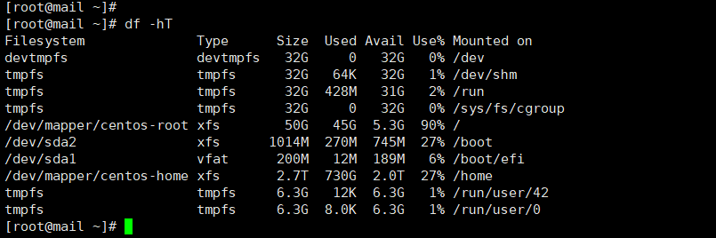

        * Filesystem： 文件系统的设备
        * Type：文件系统类型
        * Size：容量-h显示为易读容量
        * Used：使用容量
        * Avail：可用容量
        * Use%：已用百分比
        * Mounted On：挂载目录
    
         /dev/shm是使用内存虚拟出来的磁盘空间。通常会占用内存的一般容量，如果创建什么东西下次开机就会消失，因为是内存嘛。

    * du 命令
   
        `du [-ahskm] 文件或目录名称`

        + -a  ：列出所有的文件与目录容量，因为默认仅统计目录下面的目录容量包括当前目录的总容量
        + -h  ：以人们较易读的容量格式 （G/M） 显示；
        + -s  ：列出当前目录总量
        + -S  ：不包括子目录下的总计，当前目录下其他文件的加和。总容量刨去所有子目录的容量总和
        + -k  ：以 KBytes 列出容量显示；
        + -m  ：以 MBytes 列出容量显示；
    
    * 实体符号和链接符号：ln
    
         Linux中有两种链接方式。一种类似于windows总的快捷方式一样，链接到目标文件或目录，称为软链接；另一种方式通过inode链接产生新文件名，这种方式成为硬链接(hard link)。

        * Hard Link（实体链接，硬链接或实际链接）
    
         每个文件都会占用一个inode，文件内容由inode的记录指向；想要读取该文件，必须经过目录里记录的文件名指向正确的inode号码。实际上文件名是只和目录相关的。所以会有多个文件名对应同一个inode号码的情况。这就是hard link的由来。hard link就是在某个目录下新增一个文件名链接到某个inode上的记录。

         举例来说，/root/crontab2是/etc/crontab的hard link。它两链接到同一个inode上。
         ```
         ll -i /etc/crontab
         ln /etc/crontab /root/crontab2
         ll -i /etc/crontab /root/crontab2
         ```
         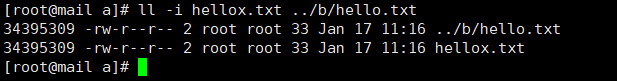</br>
         如图可以发现inode号码一样。权限属性一样。链接字段变成了2，一个inode有两个文件名。在有链接存在的情况下比较安全，删除一个文件名，inode不会被删掉另一个文件名还会指向他。有点类似前端中的访问链，只要有能访问到inode的文件名，就不会被删除掉。不管通过那个文件名编辑内容，影响的都是同一个block。一般增加链接不会消耗额外的block，只是目录下的block添加了一个文件名和inode的记录。如果恰好目录下的记录文件名的block满了，又新起了一个block的话，也算是导致磁盘空间变化。这种影响是相当轻微的，就是新增一笔记录的影响。

         hard link有限制。不能跨文件系统链接，只能在同一个文件系统上。inode号码毕竟是同一个文件系统上才能找到。不能链接目录。
    * symbolic link（符号链接，快捷方式，软链接）

         相对于hard link，symbolic link是创建了一个新的文件。该文件数据的读取直接指向link到的文件名。源文件删除后，打开软链接会提示无法打开某文件，因为找不到原始文件名。如下图所示，两个文件的Inodeshi不同的。链接文件的大小是8Bytes，因为是存储的的是文件名是8个字母。打开文件的过程先找到存储的文件名，然后打开那个文件。和windows下的快捷方式是等同的。删掉链接不影响源文件，删掉源文件，链接就无法使用了。因为是新建了一个文件所以会占用inode和block。</br>
         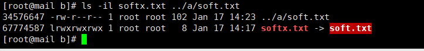</br>

         要制作链接就要使用 `ln [-sf] sourcefile targetfile` 命令。
         ```
         参数：
         -s: symbolic link。没有加参数就是hard link
         -f: 如果目标文件存在，删除目标文件再创建。

         举例一：复制/etc/passwd到/tmp下，观察inode和block
         cd /tmp
         cp -a /etc/passwd .
         du -sb; df -i
         21223147        .
         Filesystem      Inodes IUsed   IFree IUse% Mounted on
         /dev/vda1      5242880 69958 5172922    2% /

         # 检查tmp下一共有多少Bytes，和整个文件系统有多少Bytes

         举例二：将/tmp/passwd制作成hard link成为passwd-hd文件，观察文件和容量
         ln passwd passwd-hd
         du -sh; df -i .
         21223147        .
         Filesystem      Inodes IUsed   IFree IUse% Mounted on
         /dev/vda1      5242880 69958 5172922    2% /

         # 看到在/tmp下多了一个文件名，但是tmp和整个文件系统的大侠没有变化

         举例三：将/tmp/passwd创建为一个symbolic link
         ln -s passwd passwd-so
         ls -li passwd*
         671 -rw-r--r-- 2 root root 1682 Jan 10 17:07 passwd
         671 -rw-r--r-- 2 root root 1682 Jan 10 17:07 passwd-hd
         660 lrwxrwxrwx 1 root root    6 Jan 17 14:46 passwd-so -> passwd

         # passwd-so是一个新的文件，指向源文件名。因为存储的是源文件的名称6个字母所以大小是6Bytes。
         du -sh; df -i .
         21223153        .
         Filesystem      Inodes IUsed   IFree IUse% Mounted on
         /dev/vda1      5242880 69959 5172921    2% /

         # 文件系统容量增加6Bytes，使用inode增加一剩余inode减少一。

         举例四：删除tmp下的passwd，其他两个文件是否能打开
         rm -f passwd
         cat passwd-hd
         cat passwd-so
         cat: passwd-so: No such file or directory

         # passwd-hd显示正常。passwd-so显示无法打开

         ll passwd*

         # 显示软链接开始红闪，标识它已经不正常了
         ```
         
         * 关于目录的link数量。

         对文件增加hard link是链接数会增加1。创建目录时发生的情况。创建一个空目录时里面有什么内容，使用 `ls -a` 查看有两个内容一个点和两个点。自己本身链接是1，一个点增加一个链接，所以创建文件夹本身的链接数是2。两个点代表上一级目录，所以上一级目录也会增加1。可以创建一个空目录进行观察。

11. 磁盘的分区
   
    如果增加一块硬盘，需要几个步骤
       1. 磁盘分区，以创建可用的partition
       2. 对该分区格式化，以创建可用的文件系统
       3. 谨慎些，可以对刚创建的文件系统进行校验
       4. 创建挂载点，把分区挂载上来
    
    在此过程中有很多需要考虑的地方。如分区大小，是否加入日志，inode和block数量等。
    
    * 观察磁盘分区

    磁盘分区有MBR和GPT两种格式。两个格式的分区工具不一样，之后会介绍的parted工具两种都支持。一般习惯用fdisk或gdisk来处理分区。那么先找出系统上有哪些磁盘。

    * `lsblk` 列出系统上所有的磁盘
   
    lsblk可以看作是"list block disk"的缩写。列出所有存储设备

    ```
    lsblk [-dfimpt] [device]
    -d: 仅列出磁盘本身，不列出磁盘分区信息 
    -f: 同时列出磁盘内文件系统名称
    -i: 使用ASCII码输出，不使用复杂编码（在某些环境下有大用）
    -m: 同时输出该设备在/dev下的权限数据(rwx)
    -p: 列出设备的完整名称，而不是仅仅列出最后的名字
    -t: 列出磁盘的详细信息，包括磁盘贮列机制，预读写大小等

    举例一：列出本系统下所有磁盘和磁盘分区信息
    lsblk
    NAME            MAJ:MIN RM   SIZE RO TYPE MOUNTPOINT
    sda               8:0    0 446.1G  0 disk                        # 一整颗磁盘
    ├─sda1            8:1    0   600M  0 part /boot/efi
    ├─sda2            8:2    0     1G  0 part /boot
    └─sda3            8:3    0 444.5G  0 part                        # 在sda3内的文件系统
      ├─klas-root   252:0    0 390.5G  0 lvm  /
      ├─klas-swap   252:1    0     4G  0 lvm  [SWAP]
      └─klas-backup 252:2    0    50G  0 lvm  

    ```

    根据输出的信息，有一个sda磁盘设备。sda下分三个分区，其中sda3由lvm产生的文件系统。其他信息：</br>
    + NAME 就是设备名，一般会省略/dev等前导目录
    + MAJ:MIN 核心认识的设备都是通过这两个代码熟悉的！分别是 主要：次要设备代码
    + RM 是否为可卸载设备，如光盘，USB磁盘等
    + SIZE 容量大小
    + RO 为否为只读设备
    + TYPE 是磁盘(disk)/分区(partition)/只读存储器(rom) 等输出
    + MOUNTPOINT 挂载点

    ```
    举例二：仅列出/dev/sda设备内所有数据的完整文件名
     lsblk -ip /dev/sda
     NAME                        MAJ:MIN RM   SIZE RO TYPE MOUNTPOINT
     /dev/sda                      8:0    0 446.1G  0 disk 
     |-/dev/sda1                   8:1    0   600M  0 part /boot/efi
     |-/dev/sda2                   8:2    0     1G  0 part /boot
     `-/dev/sda3                   8:3    0 444.5G  0 part 
        |-/dev/mapper/klas-root   252:0    0 390.5G  0 lvm  /
        |-/dev/mapper/klas-swap   252:1    0     4G  0 lvm  [SWAP]
        `-/dev/mapper/klas-backup 252:2    0    50G  0 lvm  
    ```

    * blkid 列出设备的UUID参数

    `lsblk -f` 也会列出设备的UUID，blkid也有这样的效果。UUID是Linux给所有设备赋予的全局唯一识别码(universally unique identifier)，这个识别码会被作为挂载或者是设备/文件系统只用。
    ```
    /dev/sda1: UUID="0DF5" BLOCK_SIZE="512" TYPE="vfat" PARTLABEL="EFI System Partition" PARTUUID="1de6-4708-a797"
    /dev/sda2: UUID="221c-41ca-8482" BLOCK_SIZE="4096" TYPE="xfs" PARTUUID="c664c555-81bb-4598-8aec"
    /dev/sda3: UUID="OORk-7mzG-MTnl-eNOm" TYPE="LVM2_member" PARTUUID="a64407a3-cdb0-4246"
    /dev/mapper/klas-root: UUID="9a6b-448b-852f" BLOCK_SIZE="4096" TYPE="xfs"
    /dev/mapper/klas-swap: UUID="1498-4ad7-9741" TYPE="swap"
    /dev/mapper/klas-backup: LABEL="KYLIN-BACKUP" UUID="9696-44dc-9662" BLOCK_SIZE="4096" TYPE="xfs"
    ```

    每一行代表一个文件系统，列出主要设备名和UUID，以及文件系统的类型。

    * `parted` 列出磁盘的分区表类型和分区信息

    已经知道系统上所有的设备，通过`blkid`知道所有的文件系统。还不清楚分区信息，可以通过简单地利用parted输出，完全用法后面介绍。

    ```
    parted device-name print
    举例一：列出/dev/sda相关信息
    parted /dev/sda print
    Model: AVAGO HW-SAS3508 (scsi)                               # 磁盘的模块名称
    Disk /dev/sda: 479GB                                         # 磁盘的总容量
    Sector size (logical/physical): 512B/4096B                   # 磁盘的每个逻辑扇区/物理扇区的容量
    Partition Table: gpt                                         # 分区表格式
    Disk Flags:                                                  # 下面是分区数据
 
    Number  Start   End     Size    File system  Name                  Flags
     1      1049kB  630MB   629MB   fat32        EFI System Partition  boot, esp
     2      630MB   1704MB  1074MB  xfs
     3      1704MB  479GB   477GB                                      lvm


    ```
    * 磁盘分区 `gdisk/fdisk`

    MBR分区使用`fdisk`命令，GPT使用`gdisk`命令分区。不要搞混，两个工具的操作比较类似。

    * `gdisk`

    ```
    gdisk 设备名
    举例一： 由之前得知，系统内有/dev/sda，观察该磁盘分区和相关数据
    gdisk /dev/sda
    GPT fdisk (gdisk) version 1.0.5

    Partition table scan:
    MBR: protective 
    BSD: not present
    APM: not present
    GPT: present

    Found valid GPT with protective MBR; using GPT.

    Command (? for help): ?                                           # 按下问号查看指令
    b	back up GPT data to a file
    c	change a partition's name
    d	delete a partition                                              # 删除一个分区
    i	show detailed information on a partition
    l	list known partition types
    n	add a new partition                                             # 增加一个分区
    o	create a new empty GUID partition table (GPT)
    p	print the partition table                                       # 显示分区
    q	quit without saving changes                                     # 不做改动离开
    r	recovery and transformation options (experts only)
    s	sort partitions
    t	change a partition's type code
    v	verify disk
    w	write table to disk and exit                                    # 存储分区操作后离开
    x	extra functionality (experts only)
    ?	print this menu

    Command (? for help): 

    ```
    应该使用 `lsblk` 和 `blkid` 找出磁盘。再用`parted /dev/sda print` 找出内部分区表。然后再gdisk/fdisk来操作系统。这个软件一般用在GPT比较好。不需要记住什么，按照问号提示操作即可。可以任意操作只要按下q随时不做保存离开。观察下分区信息，按下p

    ```
    Disk /dev/sda: 935544832 sectors, 446.1 GiB                       # 磁盘扇区数量和总容量
    Model: HW-SAS3508                                                 
    Sector size (logical/physical): 512/4096 bytes                    # 单一扇区容量
    Disk identifier (GUID): AED6-46CB-B017                            # 磁盘的GPT识别码
    Partition table holds up to 128 entries
    Main partition table begins at sector 2 and ends at sector 33
    First usable sector is 34, last usable sector is 935544798
    Partitions will be aligned on 2048-sector boundaries
    Total free space is 4029 sectors (2.0 MiB)

    Number  Start (sector)    End (sector)  Size       Code  Name     # 完整分区信息
       1            2048         1230847   600.0 MiB   EF00  EFI System Partition      #第一个分区信息
       2         1230848         3327999   1024.0 MiB  8300  
       3         3328000       935542783   444.5 GiB   8E00  

    ```

    信息的上半部分列出整体磁盘信息。这个盘446.1GiB，一共那么多扇区，一个扇区512Bytes。分区最小单位是扇区。

    下半部分的分区信息表列出每个分区的个别信息。每个项的含义：
      + Number：分区编号，1号指的是/dev/sda1
      + Start(sector)：每个分区的开始扇区号码
      + End(sector)：每个分区的结束扇区号码，可以和开始扇区号码做差计算容量
      + Size：容量（例如分区1中(1230847-2048 + 1) / 1024 / 1024 = 600.00）
      + Code：在分区内可能的文件系统类型。Linux为8300，swap为8200。该项目只是一个提示，不一定真代表此分区的文件系统
      + Name：文件系统的名称
   
    发现几个信息，分区都是紧挨着，上一分区结束的扇区的下一个扇区就是下个分区的开始了。扇区没有使用完，还能分区，不过就剩下2MB了。`gdisk`命令只能由root执行。而且命令是针对的磁盘不是分区，所以对/dev/sda1执行就会出错。不要把MBR和GPT的命令搞混。

    * 用`gdisk` 增加分区

    假设需要如下分区：

       + 1GB的xfs文件系统(Linux)
       + 1GB的vfat文件系统(Windows)
       + 0.5的swap(Linux swap)
    
    开始处理
    ```
    gdisk /dev/sda
    Command （? for help）: p                # 找的最后一个sector的号码
    Command （? for help）: ?                # 查找分区命令
    Command （? for help）: n                # 开始新增分区
    Partition number （4-128, default 4）: 4  # 默认就是 4 号，所以也能 enter 即可！
    First sector （34-83886046, default = 65026048） or {+-}size{KMGTP}: 65026048  # 也能 enter
    Last sector （65026048-83886046, default = 83886046） or {+-}size{KMGTP}: +1G  # 决不要 enter
    # 这个地方可有趣了！我们不需要自己去计算扇区号码，通过 +容量 的这个方式，
    # 就可以让 gdisk 主动去帮你算出最接近你需要的容量的扇区号码喔！
    Current type is 'Linux filesystem'
    Hex code or GUID （L to show codes, Enter = 8300）: # 使用默认值即可～直接 enter 下去！
    # 这里在让你选择未来这个分区预计使用的文件系统！默认都是 Linux 文件系统的 8300 啰！
    Command （? for help）: p
    ```

    重点在"Last Sector"那一行。不要使用那个默认值，那个默认值会把剩余的空间都是用完。只需要1G空间，所以 +1G 就可以。不需要手动计算扇区的数量，命令会根据容量计算最接近的扇区数量。新增之后按下p查看分区情况。最终结果类似如下：

    ```
    Command （? for help）: p
    Number  Start （sector）    End （sector）  Size       Code  Name
       1            2048            6143   2.0 MiB     EF02
       2            6144         2103295   1024.0 MiB  0700
       3         2103296        65026047   30.0 GiB    8E00
       4        65026048        67123199   1024.0 MiB  8300  Linux filesystem
       5        67123200        69220351   1024.0 MiB  0700  Microsoft basic data
       6        69220352        70244351   500.0 MiB   8200  Linux swap
    ```

    基本上都使用默认值即可。然后通过+1G，+500M来创建所需要的分区的容量。然后是文件系统的ID， Linux 大概都是 8200/8300/8e00 等三种格式， Windows 几乎都用 0700 这样。可以按下l显示。现在就可以保存分区信息
    ```
    Command （? for help）: w

    Final checks complete. About to write GPT data. THIS WILL OVERWRITE EXISTING
    PARTITIONS!!

    Do you want to proceed? （Y/N）: y
    OK; writing new GUID partition table （GPT） to /dev/vda.
    Warning: The kernel is still using the old partition table.
    The new table will be used at the next reboot.
    The operation has completed successfully.
    # gdisk 会先警告你可能的问题，我们确定分区是对的，这时才按下 y ！不过怎么还有警告？
    # 这是因为这颗磁盘目前正在使用当中，因此系统无法立即载入新的分区表～

    [[email protected] ~]# cat /proc/partitions
    major minor  #blocks  name

    252        0   41943040 vda
    252        1       2048 vda1
    252        2    1048576 vda2
    252        3   31461376 vda3
    253        0   10485760 dm-0
    253        1    1048576 dm-1
    253        2    5242880 dm-2
    # 你可以发现，并没有 vda4, vda5, vda6 喔！因为核心还没有更新！
    ```
    系统还在使用中，没有立刻更新分区信息。有两个办法，第一重启机器，不太方便。另一个是使用partprobe命令来处理。

    * `partprobe -s` 命令更新Linux核心的分区表信息。
   
    ```
    partprobe [-s]                  # 不加上s不会出现信息

    /dev/sda: gpt partitions 1 2 3
    /dev/sdb: gpt partitions 1

    lsblk /dev/sda                  # 实际分区的情况

    cat /proc/partitions            # 核心的分区纪录
    ```

    * gdisk删除一个分区

    将刚刚新增的那个分区删除掉。
    ```
    gdisk /dev/vda
    Command （? for help）: p
    Command （? for help）: d
    Partition number （1-6）: 6
    Command （? for help）: p
    # 你会发现 /dev/vda6 不见了！非常棒！没问题就写入吧！
    Command （? for help）: w
    # 按照默认下一步操作

    lsblk                          # 还有刚刚新建的分区，需要更新一下核心分区表
    parprobe -s
    lsblk                          # 现在就好了
   
    ```

    要注意的是不要处理一个正在使用中的分区。如果已经使用了的话，必须先把分区卸载掉。否则直接删除分区的话，磁盘虽然还会写入正确的分区信息，但是核心会无法正确更新分区表信息了。所以不要轻易随便处理掉正在使用中的分区。

    * fdisk

    MBR作为被时代淘汰的工具，可能会有用到的地方。fdisk和gdisk几乎一样，使用命令提示符时gdisk是?，fdisk是m。fdisk有时会使用柱面作为一个最小单位。还有MBR分区是有限制的。
12. 磁盘的格式化
    
    分区之后自然要将文件系统进行格式化了。格式化命令就是 `mkfs` (make filesystem)。这是一个综合的命令，它会调用正确的文件系统格式化工具软件。先介绍xfs系统的 `mkfs.xfs` 。之后会介绍新一代EXT家族成员的 `mkfs.ext4`。

    * xfs文件系统的 `mkfs.xfs`

    一般说**格式化**其实就是指的是**创建文件系统(make filesystem)**。创建的是xfs文件系统，所以使用`mkfs.xfs`。命令使用如下
    ```
    mkfs.xfs [-b bsize] [-d parms] [-i parms] [-l parms] [-L label] [-f] [-r parms] 设备名称
    选项与参数：
    关於单位：下面只要谈到“数值”时，没有加单位则为 Bytes 值，可以用 k,m,g,t,p （小写）等来解释
             比较特殊的是 s 这个单位，它指的是 sector 的“个数”喔！
    -b  ：后面接的是 block 容量，可由 512 到 64k，不过最大容量限制为 Linux 的 4k 喔！
    -d  ：后面接的是重要的 data section 的相关参数值，主要的值有：
          agcount=数值  ：设置需要几个储存群组的意思（AG），通常与 CPU 有关
          agsize=数值   ：每个 AG 设置为多少容量的意思，通常 agcount/agsize 只选一个设置即可
          file          ：指的是“格式化的设备是个文件而不是个设备”的意思！（例如虚拟磁盘）
          size=数值     ：data section 的容量，亦即你可以不将全部的设备容量用完的意思
          su=数值       ：当有 RAID 时，那个 stripe 数值的意思，与下面的 sw 搭配使用
          sw=数值       ：当有 RAID 时，用于储存数据的磁盘数量（须扣除备份碟与备用碟）
          sunit=数值    ：与 su 相当，不过单位使用的是“几个 sector（512Bytes大小）”的意思
          swidth=数值   ：就是 su*sw 的数值，但是以“几个 sector（512Bytes大小）”来设置
    -f  ：如果设备内已经有文件系统，则需要使用这个 -f 来强制格式化才行！
    -i  ：与 inode 有较相关的设置，主要的设置值有：
          size=数值     ：最小是 256Bytes 最大是 2k，一般保留 256 就足够使用了！
          internal=[0&#124;1]：log 设备是否为内置？默认为 1 内置，如果要用外部设备，使用下面设置
          logdev=device ：log 设备为后面接的那个设备上头的意思，需设置 internal=0 才可！
          size=数值     ：指定这块登录区的容量，通常最小得要有 512 个 block，大约 2M 以上才行！
    -L  ：后面接这个文件系统的标头名称 Label name 的意思！
    -r  ：指定 realtime section 的相关设置值，常见的有：
          extsize=数值  ：就是那个重要的 extent 数值，一般不须设置，但有 RAID 时，
                         最好设置与 swidth 的数值相同较佳！最小为 4K 最大为 1G 。

    举例一：将之前的分出来的分区格式化为xfs文件系统
    mkfs.xfs /dev/vda4
    meta-data=/dev/vda4       isize=256    agcount=4, agsize=65536 blks
             =                sectsz=512   attr=2, projid32bit=1
             =                crc=0        finobt=0
    data     =                bsize=4096   blocks=262144, imaxpct=25
             =                sunit=0      swidth=0 blks
    naming   =version 2       bsize=4096   ascii-ci=0 ftype=0
    log      =internal log    bsize=4096   blocks=2560, version=2
             =                sectsz=512   sunit=0 blks, lazy-count=1
    realtime =none            extsz=4096   blocks=0, rtextents=0

    # 没有加额外参数配置，格式化很快完毕。比较重要的是Inode和block的数量

    blkid /dev/vda4
    /dev/vda4: UUID="39293f4f-627b-4dfd-a015-08340537709c" TYPE="xfs"
    # 确定创建好 xfs 文件系统了！
    ```
    使用默认命令就可以创建文件系统。如果想要配置额外的内容才需要加上设置值。例如xfs可以使用多个读写流来读写，可以用agcount和CPU核心数做搭配。假设服务器有一颗4核心的CPU，启用Intel超线程就会仿真出8核心，那么agcount就可以设置为8
    ```
    cat 'processor' /proc/cpuinfo
    processor       : 0
    processor       : 1
    # 所以就是有两颗 CPU 的意思，那就来设置设置我们的 xfs 文件系统格式化参数吧！！
    mkfs.xfs -f -d agcount=2 /dev/vda4
    # 因为此前格式化过一次，所有使用f参数强制格式化。两核心对应agcount设置为2
    ```
    * xfs文件系统for RAID性能优化

    。。。
    * EXT4文件系统mkfs.ext4

    想要使用ext4格式的文件系统，使用 `mkfs.ext4` 命令。
    ```
    mkfs.ext4 [-b size] [-L label] 设备名称
    -b  ：设置 block 的大小，有 1K, 2K, 4K 的容量，
    -L  ：后面接这个设备的标头名称。

    举例一：将/dev/vda5格式化为ext4文件系统
    mkfs.ext4 /dev/vda5

    dumpe2fs -h /dev/vda5
    # 查看文件系统信息
    ```
    * 其他文件系统mkfs

    mkfs是个综合命令，使用`mkfs -t xfs` 类似于`mkfs.xfs`。打出mkfs然后tab就能看到系统支持的文件系统类新。如果想要格式化为VFAT格式。
    ```
    mkfs -t vfat /dev/vda5
    ```
   
13. 文件系统检验

    系统运行难免会有各种问题，硬件的软件的。如之前提高的磁盘和内存数据没有同步好。如果文件系统出现错误，该如何挽回。不同文件系统的方式不太一样，现在针对xfs和ext4说明。

    * `xfs_repair` 处理xfs文件系统
    当有xfs文件系统错乱时会用到这个命令。最好不要用到，但发生问题时又十分重要
    ```
    xfs_repair [-fnd] 设备名称
    选项与参数：
    -f  ：后面的设备其实是个文件而不是实体设备
    -n  ：单纯检查并不修改文件系统的任何数据 （检查而已）
    -d  ：通常用在单人维护模式下面，针对根目录 （/） 进行检查与修复的动作！很危险！不要随便使用

    xfs_repair /dev/vda4
    Phase 1 - find and verify superblock...
    Phase 2 - using internal log
    Phase 3 - for each AG...
    Phase 4 - check for duplicate blocks...
    Phase 5 - rebuild AG headers and trees...
    Phase 6 - check inode connectivity...
    Phase 7 - verify and correct link counts...
    done
    # 共有 7 个重要的检查流程！详细的流程介绍可以 man xfs_repair 即可！
    
    [root@mail ~]# xfs_repair /dev/mapper/centos-home 
    xfs_repair: /dev/mapper/centos-home contains a mounted filesystem
    xfs_repair: /dev/mapper/centos-home contains a mounted and writable filesystem
 
    fatal error -- couldn't initialize XFS library
    ```

    xfs_repair可以修复检查文件系统，修复任务过于庞大不能在挂载了的情况下修复，否则出现上面提示的错误。如果可以卸载的话，卸载后再进行修复。linux有个设备不能被卸载，那就是根目录。根目录出问题怎么办，这时进入单人模式或救援模式。加入-d选项，系统强制检验设备，然后重启开机。这是件比较可怕事情...

    * fsck.ext4处理ext4文件系统

    fsck是综合命令，针对ext4的话用fsck.ext4就可以。fsck.ext4有如下的选项
    ```
    fsck.ext4 [-pf] [-b superblock] 设备名称
    选项与参数：
    -p  ：当文件系统在修复时，若有需要回复 y 的动作时，自动回复 y 来继续进行修复动作。
    -f  ：强制检查！一般来说，如果 fsck 没有发现任何 unclean 的旗标，不会主动进入
          细部检查的，如果您想要强制 fsck 进入细部检查，就得加上 -f 旗标啰！
    -D  ：针对文件系统下的目录进行最优化配置。
    -b  ：后面接 superblock 的位置！一般来说这个选项用不到。但是如果你的 superblock 因故损毁时，
          通过这个参数即可利用文件系统内备份的 superblock 来尝试救援。一般来说，superblock 备份在：
          1K block 放在 8193, 2K block 放在 16384, 4K block 放在 32768
    ```

    无论是xfx_repair还是fsck.ext4都是用来检查文件系统错误的指令。通常文件系统出现问题在root用户下才能执行的命令。否则在系统正常的情况使用可能会造成大的危害。通常是在文件系统发生极大故障，在linux开机的时候需要进入单人模式下进行维护时，才必须使用此指令。
14. 文件系统挂载和卸载
    之前提到过挂载点就是目录，目录是进入磁盘分区（文件系统）的入口。在挂载之前需要确认几件事
      * 单一文件系统不应该被挂载在不同的目录中
      * 单一目录应该重复挂载多个文件系统
      * 作为挂载点的目录，理论上应该是空目录
    
    尤其是后面两点，当目录不是空的情况下，再挂载文件系统后原来目录下的内容会暂时消失。举例来说，/和/home在同一文件系统下，原来就有/home/test和/home/vbird两个目录。然后加入新的磁盘挂到了/home下，那么现在的/home就显示的是新分区的内容，原来的内容就会被隐藏掉注意不是覆盖。等新分区卸载掉之后原来的目录就又出来了。

    挂载命名 `mount` 内容十分的丰富。介绍一些简单的内容。
    ```
    mount -a
    mount -l
    mount [-t 文件系统] LABEL='' 挂载点
    mount [-t 文件系统] UUID='' 挂载点       #推荐使用
    mount [-t 文件系统] 设备文件名 挂载点
    选项和参数：
    -a: 依照配置文件[/etc/fstab]的数据将所有未挂载的磁盘都挂载上了
    -l: 单纯输入mount命令会显示目前挂载信息，加上-l可增加Label名称
    -t: 加上文件系统名称种类来指定要挂载的类型。如Linux支持的：xfs, ext3, ext4, reiserfs, vfat, iso9960(光盘格式), nfs, cifs, smbfs(后三种为网络文件系统类型)
    -n: 在默认情况下，系统会将实际挂载的情况写入/etc/mtab。但在某些情况如单人模式情况下就可以不写入。此时就要用这个参数
    -o: 后面可以接一些挂载时额外加上的参数！比方说帐号、密码、读写权限等：
    ```

    CentOS7 下挂载不需要加-t参数，系统会自动使用最恰当的文件系统来挂载设备。这也是`blkid`能正确显示的缘故。CentOS怎么找出文件系统类型呢，几乎所有文件系统都有super block，Linux通过分析superblock搭配Linux自己的驱动程序来测试挂载，如果成功配套那么就会使用那个类型去挂载。系统指定哪些文件系统类型进行这样的测试呢，如下两个：
       * /etc/filesystems: 系统指定的测试挂载文件系统类型优先顺序
       * /proc/filesystems: Linux已经载入的文件系统类型
   
    Linux把支持文件系统的驱动程序记录在 /lib/modules/$ (uname -r) /kernel/fs/

    过去习惯使用设备名直接挂载，推荐使用设备UUID来识别文件系统，比设备名称和标签可靠，因为UUID是唯一的

    * 挂载 xfs/ext4/vfat 等文件系统
    ```
    找出/dev/vda4的UUID，用该UUID挂载文件系统到/data/xfs内
    blkid /dev/vda4
    /dev/vda4: UUID="e0a6af55-26e7-4cb7-a515-826a8bd29e90" TYPE="xfs"

    mount UUID="e0a6af55-26e7-4cb7-a515-826a8bd29e90" /data/xfs
    mount: mount point /data/xfx does not exist!       # 没有创建该目录

    mkdir -p /data/xfs
    mount UUID="e0a6af55-26e7-4cb7-a515-826a8bd29e90" /data/xfs
    df /data/xfs
    Filesystem     1K-blocks  Used Available Use% Mounted on
    /dev/vda4        1038336 32864   1005472   4% /data/xfs

    ```

    * 挂载CD或DVD光盘

    拿出CentOS原版光盘，放入光驱，测他一测
    ```
    将CentOS原版光盘挂载到/data/cdrom下
    blkid
    .....（前面省略）.....
    /dev/sr0: UUID="2015-04-01-00-21-36-00" LABEL="CentOS 7 x86_64" TYPE="iso9660" PTTYPE="dos"

    mkdir /data/cdrom
    mount /dev/sr0 /data/cdrom

    df /data/cdrom
    Filesystem     1K-blocks    Used Available Use% Mounted on
    /dev/sr0         7413478 7413478         0 100% /data/cdrom
    # 怎么会使用掉 100% 呢？是啊！因为是 DVD 啊！所以无法再写入了啊！
    ```
    光驱挂载后不能退出，除非把目录卸载掉。光盘不能写入，所以容量使用直接100%。如果使用的是图形系统，系统还会自动挂到/media，不卸载也可以自动退出。

    * 挂载vfat中文U盘（USB磁盘）

    拿出你的U盘查到Linux的USB接口上，注意U盘不能是NTFS文件系统。测他一测
    ```
    blkid
    /dev/sda1: UUID="35BC-6D6B" TYPE="vfat"

    mkdir /data/usb
    mount -o codepage=950, ioscharset=utf8 UUID="35BC-6D6B" /data/usb
    df /data/usb
    Filesystem     1K-blocks  Used Available Use% Mounted on
    /dev/sda1        2092344     4   2092340   1% /data/usb
    ```
    如果有中文文件名的数据，可以在挂载时指定下文件系统所使用的语系。在`man mount`中查找vfat可以使用pagecode处理，中文是950。再指定utf8编码格式。如果U盘是NTFS格式，就需要安装NTFS文件系统的驱动程序，默认是没有的。

    * 重新挂载目录和挂载不特定目录

    整个目录树最重要的就是根目录了，根目录不能被卸载。如果挂载参数更改，或者出现只读情况时，如何重新挂载。可以reboot也可以这样 `mount -o remount, rw, auto /`

    也可以利用mount将某个目录挂载到另一个目录下。不是挂载文件系统而是而外挂载一个目录。和symbolic link一样的作用，但是在某些不支持符号链接的情况下，只能用挂载目录方式
    ```
    将/var挂载到/data/var
    mkdir /data/var
    mount --bind /var /data/var
    ls -bid /var /data/var
    ```
    观察链接两个目录链接到同一个目录，mount --bind 可以将目录挂载到另一个目录，而不是整个文件系统。所以进入/data/var就是进入/var

    * unmount(卸载文件系统)

    ```
    umount [-fn] 文件设备名或挂载点
    选项与参数：
    -f  ：强制卸载！可用在类似网络文件系统 （NFS） 无法读取到的情况下；
    -l  ：立刻卸载文件系统，比 -f 还强！
    -n  ：不更新 /etc/mtab 情况下卸载。
    ```
    卸载之后查看df或mount是否还在目录树中。可以按照设备名或者挂载点卸载。卸载之后可以推出光盘U盘了。如果恰好在要卸载的目录中时，也会卸载失败，退出到根目录再卸载就OK了。
15. 磁盘/文件系统参数修订

    某些时刻，想要修改文件系统的某些参数，比如Label Name或者journal相关参数等。需要下面相关命令

    * mknod

    之前说在Linux所有设备都用文件来代替，那么文件时如何代表设备的，就是通过文件的major和minor数值。所以major和minor拥有特殊意义不能随意修改。如查看/dev/sda下的设备
    ```
    ll /dev/sda*
    brw-rw---- 1 root disk 8, 0 Jan 20 19:57 /dev/sda
    brw-rw---- 1 root disk 8, 1 Jan 20 19:57 /dev/sda1
    brw-rw---- 1 root disk 8, 2 Jan 20 19:57 /dev/sda2
    brw-rw---- 1 root disk 8, 3 Jan 20 19:57 /dev/sda3
    ```
    结果中的9是主要设备代码(Major)，0123是次要设备代码(Minor)。Linux核心就是根据这两个数字认识设备的，举例常见的设备代码如下：</br>
    |磁盘文件名|Major|Minor|
    |:----:|:----:|:----:|
    |/dev/sda|8|0-15|
    |/dev/sdb|8|16-31|
    |/dev/loop0|7|0|
    |/dev/loop1|7|1|
    想了解更多核心支持的硬件设备代码，请查看[官网](https://www.kernel.org/doc/Documentation/)。基本上，核心2.6之后硬件文件名系统自动实时产生。我们不需要手动创建设备文件，不过有时候需要手动处理。例如某些服务关到特定目录下(chroot)时。
    ```
    mknod 设备文件名 [bcp] [Major] [Minor]
    选项与参数：
    设备种类：
       b  ：设置设备名称成为一个周边储存设备文件，例如磁盘等；
       c  ：设置设备名称成为一个周边输入设备文件，例如鼠标/键盘等；
       p  ：设置设备名称成为一个 FIFO 文件；
    Major ：主要设备代码；
    Minor ：次要设备代码；

    范例：由上述的介绍我们知道 /dev/vda10 设备代码 252, 10，请创建并查阅此设备
    [root@study ~]# mknod /dev/vda10 b 252 10
    [root@study ~]# ll /dev/vda10
    brw-r--r--. 1 root root 252, 10 Jun 24 23:40 /dev/vda10
    # 上面那个 252 与 10 是有意义的，不要随意设置啊！

    范例：创建一个 FIFO 文件，文件名为 /tmp/testpipe
    [root@study ~]# mknod /tmp/testpipe p
    [root@study ~]# ll /tmp/testpipe
    prw-r--r--. 1 root root 0 Jun 24 23:44 /tmp/testpipe
    # 注意啊！这个文件可不是一般文件，不可以随便就放在这里！
    # 测试完毕之后请删除这个文件吧！看一下这个文件的类型！是 p 喔！^_^

    rm /dev/vda10 /tmp/testpipe
    rm: remove block special file '/dev/vda10' ? y
    rm: remove fifo '/tmp/testpipe' ? y
    ```

    * xfs_admin 修改 XFS 文件系统的 UUID 与 Label name
    如果你当初格式化的时候忘记加上标头名称，后来想要再次加入时，不需要重复格式化！直接使用这个 xfs_admin 即可。 这个指令直接拿来处理 LABEL name 以及 UUID 即可

    ```
    [root@study ~]# xfs_admin [-lu] [-L label] [-U uuid] 设备文件名
    选项与参数：
    -l  ：列出这个设备的 label name
    -u  ：列出这个设备的 UUID
    -L  ：设置这个设备的 Label name
    -U  ：设置这个设备的 UUID 

    设置 /dev/vda4 的 label name 为 vbird_xfs，并测试挂载
    xfs_admin -L vbird_xfs /dev/vda4
    writing all SBs
    new label = "vbird_xfs"                 # 产生新的 LABEL 名称啰！
    xfs_admin -l /dev/vda4

    uuidgen
    ```

    * tune2fs 修改 ext4 的 label name 与 UUID
    ```
    tune2fs [-l] [-L Label] [-U uuid] 设备文件名
    选项与参数：
    -l  ：类似 dumpe2fs -h 的功能～将 superblock 内的数据读出来～
    -L  ：修改 LABEL name
    -U  ：修改 UUID 
    ```
16. 设置开机挂载
   
    手动mount的内容，开机时就会卸载掉。每次手动处理不方便，所以需要每次开机时自动挂载。

    * 开机挂载/etc/fstab和/etc/mtab
    
    自动设置到/etc/fstab中进行设置，但是系统挂载有一些限制。

       + 根目录/是必须挂载的，而且必须先于其他挂载点挂载起来
       + 其他挂载点必须是已经创建好的目录，可以任意指定，但是要遵循系统目录架构原则(FHS)
       + 所有挂载点在同一时间只能挂载一次
       + 要是进行卸载，必须将当前目录移到要卸载的目录外
    看下/etc/fstab中的内容
    ```
    [[email protected] ~]# cat /etc/fstab
    # Device                              Mount point  filesystem parameters    dump fsck
    /dev/mapper/centos-root                   /       xfs     defaults            0 0
    UUID=94ac5f77-cb8a-495e-a65b-2ef7442b837c /boot   xfs     defaults            0 0
    /dev/mapper/centos-home                   /home   xfs     defaults            0 0
    /dev/mapper/centos-swap                   swap    swap    defaults            0 0
    ```
    /etc/fstab(filesystem table)就是将mount时所用的参数写到的文件。此外还有dump字段用作备份，还有fsck字段用在开机是否进行文件系统校验。文件共6个字段，了解下。
    ```
    [设备/UUID等] [挂载点] [文件系统类型] [文件系统参数] [dump] [fsck]
    ```
    * 第一列：磁盘设备文件名/UUID/Lable Name。这一列可以填的就是三个项目。文件系统或磁盘设备名如/dev/sda2，UUID名称UUID=xx，Lable名称LABEL=xx。一般使用UUID是更好的选择
    * 第二列：挂载点(mount point)。挂载的目录
    * 第三列：磁盘分区的文件系统。手动挂载时可以自动获取类型，在这个文件里需要手动指定
    * 第四列：文件系统参数
    
      之前就使用过参数指定文件系统的文件名语言编码。
      |参数|参数解释|
      |:----|:----|
      |async/sync 非同步/同步|设置磁盘是否以非同步方式运行！默认为 async（性能较佳）|
      |auto/noauto 自动/非自动|当下达 mount -a 时，此文件系统是否会被主动测试挂载。默认为 auto。|
      |rw/ro 可读写/只读|让该分区以可读写或者是只读的型态挂载上来，如果你想要分享的数据是不给使用者随意变更的， 这里也能够设置为只读。则不论在此文件系统的文件是否设置 w 权限，都无法写入|
      |exec/noexec 可执行/不可执行|限制在此文件系统内是否可以进行“执行”的工作？如果是纯粹用来储存数据的目录， 那么可以设置为 noexec 会比较安全。不过，这个参数也不能随便使用，因为你不知道该目录下是否默认会有可执行文件。举例来说，如果你将 noexec 设置在 /var ，当某些软件将一些可执行文件放置于 /var 下时，那就会产生很大的问题喔！ 因此，建议这个 noexec 最多仅设置于你自订或分享的一般数据目录。|
      |user/nouser 允许/不允许使用者挂载|是否允许使用者使用 mount指令来挂载呢？一般而言，我们当然不希望一般身份的 user 能使用 mount 啰，因为太不安全了，因此这里应该要设置为 nouser 啰！|
      |suid/nosuid 具有/不具有 suid 权限|该文件系统是否允许 SUID 的存在？如果不是可执行文件放置目录，也可以设置为 nosuid 来取消这个功能！|
      |defaults|同时具有 rw, suid, dev, exec, auto, nouser, async 等参数。 基本上，默认情况使用 defaults 设置即可！|

    * 第五列：能否被dump备份命令作用。dump是一个备份的指令，现在有很多代替方案，置为0即可。
    * 第六列：fsck检查文件系统标志。该字段不适用于xfs文件系统，置为0即可。

    查看我们的新建的文件系统能否开机自动挂载。先`df`看是否挂载，如果挂载了的话，给他卸载掉。然后将要挂载的信息写入/etc/fstab。然后`mount -a`，再看`df`是否挂载了。再reboot看开机是否自动挂载。/etc/fstab是开机挂载的配置文件，实际文件系统挂载是记录到/etc/mtab和/proc/mounts中的。每次挂载时也会更新这两个文件。如果/etc/fstab录入有错，导致无法顺利开机而进入单人维护模式时，根目录是只读的无法修改/etc/fstab怎么办。可以使用这个命令：
    ```
    mount -n -o remount,rw /
    ```
    * 特殊设备loop挂载（镜像文件不用烧录就挂载使用）
    
    如果有光盘镜像文件或者文件作为磁盘的方式时，需要用特殊方法挂载不需要烧录。

    * 挂载光盘/DVD镜像文件
    
    创建一个空目录/data/centos_dvd，使用命令`mount -o loog xxx.iso /data/centos_dvd`。就把镜像文件挂载到目录上了，然后可以使用目录中的内容。iso有被做修改的可能，所以一般会有MD5校验的过程，有必要的话。

    * 创建大文件以制作loop设备文件
    
    既然可以挂在DVD镜像文件，那么可否制作一个大文件然后将大文件格式化后挂载呢。这个有大用，比如给根目录分了一个巨大的空间没有额外空间进行其他的分区操作。就可以制作一个大文件，然后把大文件挂载，如此就会觉得多了一个分区。

    测试在大空间分区(/home)内创建一个512M的大文件。然后把这个大文件挂载。

    * 创建大文件
    
    使用`dd`命令创建空的文件。详情见下章压缩命令和应用，此处做简单介绍。先创建一个空的大文件/home/loopTest/loopDev
    ```
    [root@mail loopTest]# dd if=/dev/zero of=/srv/loopdev bs=1M count=512
    512+0 records in
    512+0 records out
    536870912 bytes (537 MB) copied, 0.368939 s, 1.5 GB/s
    # 这个指令的简单意义如下：
    # if    是 input file ，输入文件。那个 /dev/zero 是会一直输出 0 的设备！
    # of    是 output file ，将一堆零写入到后面接的文件中。
    # bs    是每个 block 大小，就像文件系统那样的 block 意义；
    # count 则是总共几个 bs 的意思。所以 bs*count 就是这个文件的容量了！
    [root@mail loopTest]# ll -h
      total 512M
    -rw-r--r-- 1 root root 512M Jan 25 16:31 loopDev
    ```
    dd将512个1M文件堆起来就是一个512M的文件。

    * 大文件的格式化
    
    默认xfs不能格式化文件，需要加一些参数才可以。
    ```
    mkfs.xfs -f /srv/loopdev
    blkid /srv/loopdev
    /srv/loopdev: UUID="5109015f-dab1-43a8-b548-a4c0006f5e20" TYPE="xfs"
    ```

    * 挂载
    使用mount 和特殊参数进行挂载
    ```
    mkdir -p /mnt
    mount -o loop UUID="5109015f-dab1-43a8-b548-a4c0006f5e20" /mnt
    ```
    这样就挂载上了。这样在原本的分区上环境制作一个分区，十分好用。CentOS比较智能，即使不加参数也能识别文件挂载，为了向下兼容也可以加上参数。现在把这个文件系统配置好开机挂载
    ```
    umount /mnt
    vim /etc/fstab
    /srv/loopdev  /data/file  xfs  defaults**,loop**   0 0
    mount -a
    [root@VM-4-15-centos srv]# df -hT /data/file/
    Filesystem     Type  Size  Used Avail Use% Mounted on
    /dev/loop0     ext4  488M  780K  452M   1% /data/file

    # 因为测试机是ext4文件系统，所以采用ext4，区别有两点
    # 格式化时不加-f参数
    # /etc/fstab 里的参数是defaults
    ```
17. 内存交换(swap)空间创建
    
    以前内存不够的时候，一个暂时将内存的程序放到硬盘的内存交换空间是十分重要的。为了避免内存耗尽引起问题的解决办法。以前安装linux时一般必有的两个分区一个是根目录一个是swap。

    一般来说内存够用的话，swap是不会被用到的，被用到那就是内存不够了。内存不够时内存中暂时不用的程序和数据被移到swap中给需要的程序腾出空间。swap是在磁盘上，当swap被用到时磁盘灯就开始闪个不停了。

    现在内存可能都会够，但是还是最好预留些swap来做缓冲。

    * 使用实体分区创建swap
    
    创建swap分区非常简单，按照以下步骤：
       
       1. 分区：先使用gdisk从磁盘中分一个分区给swap。
       2. 格式化：利用swap格式的 `mkswap 设备文件名` 就能格式化该分区成为swap格式
       3. 使用：将该swap设备启动，命令：`swapon 设备文件名`
       4. 观察：最终通过`free`和`swapon -s`来观察内存
    
    * 1.分区
    ```
    gdisk /dev/vda

    [[email protected] ~]# gdisk /dev/vda
    Command （? for help）: n
    Partition number （6-128, default 6）:
    First sector （34-83886046, default = 69220352） or {+-}size{KMGTP}:
    Last sector （69220352-83886046, default = 83886046） or {+-}size{KMGTP}: +512M
    Current type is 'Linux filesystem'
    Hex code or GUID （L to show codes, Enter = 8300）: 8200
    Changed type of partition to 'Linux swap'
 
    Command （? for help）: p
    Number  Start （sector）    End （sector）  Size       Code  Name
       6        69220352        70268927   512.0 MiB   8200  Linux swap  # 重点就是产生这东西！

    Command （? for help）: w
 
    Do you want to proceed? （Y/N）: y
 
    [[email protected] ~]# partprobe
    [[email protected] ~]# lsblk
    NAME            MAJ:MIN RM  SIZE RO TYPE MOUNTPOINT
    vda             252:0    0   40G  0 disk
    .....（中间省略）.....
    `-vda6          252:6    0  512M  0 part   # 确定这里是存在的才行！
   
    ```
    * 2.创建swap格式
    ```
    mkswap /dev/vda6
    Setting up swapspace version 1, size = 524284 KiB
    no label, UUID=6b17e4ab-9bf9-43d6-88a0-73ab47855f9d

    [[email protected] ~]# blkid /dev/vda6
    /dev/vda6: UUID="6b17e4ab-9bf9-43d6-88a0-73ab47855f9d" TYPE="swap"
    # 确定格式化成功！且使用 blkid 确实可以抓到这个设备了喔！
    ```
    * 3.观察载入查看
    ```
    free
                  total        used        free      shared  buff/cache   available
    Mem:        1275140      227244      330124        7804      717772      875536  # 实体内存
    Swap:       1048572      101340      947232                                      # swap 相关
    # 我有 1275140K 的实体内存，使用 227244K 剩余 330124K ，使用掉的内存有
    # 717772K 用在缓冲/高速缓存的用途中。至于 swap 已经有 1048572K 啰！这样会看了吧？！

    [[email protected] ~]# swapon /dev/vda6
    [[email protected] ~]# free
                total        used        free      shared  buff/cache   available
    Mem:        1275140      227940      329256        7804      717944      874752
    Swap:       1572856      101260     1471596   &lt;==有看到增加了没？

    [[email protected] ~]# swapon -s
    Filename                 Type            Size    Used    Priority
    /dev/dm-1                partition       1048572 101260  -1
    /dev/vda6                partition       524284  0       -2
    # 上面列出目前使用的 swap 设备有哪些的意思！
 
    [[email protected] ~]# nano /etc/fstab
    UUID="6b17e4ab-9bf9-43d6-88a0-73ab47855f9d"  swap  swap  defaults  0  0
    # 当然要写入配置文件，只不过不是文件系统，所以没有挂载点！第二个字段写入 swap 即可。
    ```

    * 使用文件创建swap
   
    如果没有实体分区，现在就可以使用前一节的创建文件分区的方法。现在就创建一个128M的内存交换空间

       1. 使用dd命令在/tmp下增加一个128M的文件
       ```
       [root@VM-4-15-centos ~]# dd if=/dev/zero of=/tmp/swap bs=1M count=128
       128+0 records in
       128+0 records out
       134217728 bytes (134 MB, 128 MiB) copied, 0.0933353 s, 1.4 GB/s

       [root@VM-4-15-centos ~]# ll -h /tmp/swap
       -rw-r--r-- 1 root root 128M Jan 27 10:18 /tmp/swap
       ```
       2. 使用mkswap将/tmp/swap文件格式化为swap的文件格式
       ```
       [root@VM-4-15-centos ~]# mkswap /tmp/swap
       mkswap: /tmp/swap: insecure permissions 0644, 0600 suggested.
       Setting up swapspace version 1, size = 128 MiB (134213632 bytes)
       no label, UUID=a88ae7ba-1622-41b8-838e-df6e68c8b901
       ```
       3. 使用swapon启动/tmp/swap
       ```
       [root@VM-4-15-centos ~]# swapon /tmp/swap
       swapon: /tmp/swap: insecure permissions 0644, 0600 suggested.
       [root@VM-4-15-centos ~]# swapon -s
       Filename                                Type            Size    Used    Priority
       /tmp/swap                               file            131068  0       -2
       ```
       4. 使用swapoff关闭swap file, 设置自动启动
       ```
       vim /etc/fstab
       /tmp/swap  swap  swap  defaults  0  0
       # 为何这里不要使用 UUID 呢？这是因为系统仅会查询区块设备 （block device） 不会查询文件！
       # 所以，这里千万不要使用 UUID，不然系统会查不到喔！

       swapoff /tmp/swap
       swapon -s
       # 确定已经回复到原本的状态了！然后准备来测试！！
       swapon -a
       swapon -s
       又看到swap空间了，设置/etc/fstab完毕
       ```
    一般桌面系统都用不到，一般linux也用不到。但是对于服务器和工作站这种提供长时服务的系统来说，swap还是需要创建的。如果机器支持休眠模式，休眠时运行程序的状态就会放到swap中。另外有些程序在运行时就会利用swap的特性向swap中放入数据。swap是需要创建的，只不过不需要很大。

18. 文件系统的特殊观察和操作
    * 磁盘空间浪费问题
    一个block只能存放一个文件，所以小文件的存在就是浪费。文件系统中的super block和inode table等中介数据等也是浪费磁盘的存在，所以创建出文件系统后很多容量就被用掉了。

    在输入`ll -sh`第一行显示total字样。就是目录下用掉的block的容量。
    ```
    [root@mail ipTest]# ll -sh
    total 12K
    4.0K -rw-r--r-- 1 root root 350 Apr 22  2021 Main2.java
    4.0K -rw-r--r-- 1 root root 832 Apr 22  2021 Main.class
    4.0K -rw-r--r-- 1 root root 350 Jan 14 10:01 Main.java
    ```
    三个文件加起来不到2K，但是使用了12K的block存储。

    * 利用GNU的parted进行分区
19. 重点回顾
    


       


    


   


      


      
        


---
# 四、Linux磁盘与文件系统
   
   

   


___

## 四、测试
* 这是谷歌[gooooooooooogle](https://www.google.com)
* 这不是我的邮箱<abc@hello.com>

	

	

	
	